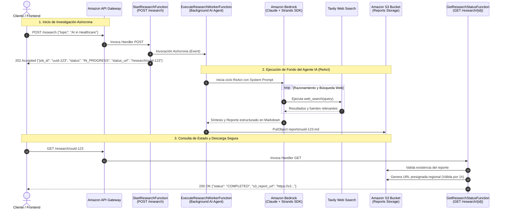

# Serverless AI Research Agent on AWS

[](https://www.python.org/)
[](https://aws.amazon.com/serverless/sam/)
[](https://aws.amazon.com/bedrock/)
[](docs/architecture.md)
[](tests/)

Agente autónomo de investigación profunda impulsado por Inteligencia Artificial y construido bajo una arquitectura **100% Serverless-First en AWS**. Utiliza el patrón **ReAct (Reasoning + Acting)** en **Amazon Bedrock**, el framework **Strands Agents SDK**, búsquedas web en tiempo real con **Tavily API**, y almacenamiento de reportes Markdown en **Amazon S3**.

El proyecto sigue rigurosamente los principios de **`arch-core`**: arquitectura en **dos capas principales (`app/` y `context/`)**, Arquitectura Hexagonal (Ports & Adapters), DDD, CQRS, **Cadena de Responsabilidad (Chain of Responsibility)** para la orquestación de casos de uso, observabilidad desacoplada con **AWS Lambda Powertools**, y manejo funcional de errores mediante **Railway-Oriented Programming (`Result[O, E]`)**.

---

## 🏛️ Arquitectura del Sistema

El agente resuelve la limitación de timeout de 29 segundos de Amazon API Gateway mediante un **Patrón Asíncrono Desencadenado por Eventos (*Event-Driven Polling Pattern*)**:



---

## 📂 Estructura del Proyecto (Arquitectura en Dos Capas)

La base de código está estructurada en dos capas macro con aislamiento estricto:

```
serverless-research-agent-aws/
├── src/
│   ├── app/                              # CAPA 1: PRESENTACIÓN Y ENTREGA
│   │   ├── aws/
│   │   │   ├── handlers/                 # Delivery Handlers delgados específicos de AWS Lambda
│   │   │   │   ├── start_research_handler.py
│   │   │   │   ├── get_research_status_handler.py
│   │   │   │   └── execute_research_worker_handler.py
│   │   │   ├── powertools.py             # Instancias singleton de Logger, Tracer y Metrics
│   │   │   └── response.py               # Mapeador de Result y DomainError a respuestas HTTP
│   │   └── controllers/                  # Controladores CQRS con decoradores de observabilidad
│   │       ├── base.py                   # Contratos ICommandHandler y IQueryHandler
│   │       ├── start_research_controller.py
│   │       ├── get_research_status_controller.py
│   │       ├── execute_research_worker_controller.py
│   │       └── decorators/               # Decoradores (LoggingDecorator, MetricsDecorator)
│   │
│   └── context/                          # CAPA 2: BOUNDED CONTEXTS & CORE DDD
│       ├── kit/                          # Kit de utilidades y bloques fundamentales reutilizables
│       │   ├── chain/                    # Motor de Chain of Responsibility (ChainBuilder, Step)
│       │   ├── command/                  # Abstracciones y decoradores para Comandos (CQRS)
│       │   ├── query/                    # Abstracciones y decoradores para Consultas (CQRS)
│       │   ├── criteria/                 # Patrón Criteria (Filtros, Ordenamiento, Paginación)
│       │   ├── dtos/                     # DTOs (Result, Optional, Either, Metadata, MetricUnit)
│       │   ├── errors/                   # Jerarquía de DomainError (Validation, NotFound, etc.)
│       │   ├── service/                  # 18 Contratos de servicios e interfaces abstractas
│       │   └── vo/                       # Value Objects (Uuid, Date, String, Number, Boolean)
│       │
│       └── research/                     # Bounded Context de Investigación
│           ├── domain/                   # Puertos e interfaces del negocio
│           │   └── ports.py              # IReportStoragePort, IResearchAgentPort, IAsyncWorkerInvokerPort
│           ├── application/              # Casos de Uso estructurados como Pipelines de Pasos
│           │   ├── dtos/                 # DTOs inmutables de entrada y salida
│           │   └── use_cases/            # StartResearchUseCase, GetResearchStatusUseCase, ExecuteResearchWorkerUseCase
│           └── infrastructure/           # Adaptadores concretos y Ensamblaje Manual
│               ├── infrastructure_factory.py # Fábrica abstracta de inyección de dependencias
│               ├── bedrock_agent_adapter.py  # Adaptador Strands + Amazon Bedrock
│               ├── s3_storage_adapter.py     # Adaptador de almacenamiento Amazon S3
│               ├── lambda_invoker_adapter.py # Adaptador de invocación asíncrona de AWS Lambda
│               ├── tavily_search_tool.py     # Tool de búsqueda web con Tavily API
│               └── powertools_adapters.py    # Adaptadores de observabilidad (Logger/Metrics)
│
├── docs/                                 # DOCUMENTACIÓN TÉCNICA
│   ├── architecture.md                   # Especificación detallada de arquitectura y flujos
│   ├── openapi.yaml                      # Especificación OpenAPI 3.0 de los endpoints REST
│   └── adr/                              # Architecture Decision Records (ADRs)
│       ├── 0001-use-serverless-ai-agent-architecture.md
│       ├── 0002-async-agent-execution.md
│       └── 0003-two-layer-clean-architecture-and-design-patterns.md
│
├── tests/                                # SUITE INTEGRAL DE PRUEBAS (93 Tests)
│   ├── test_controllers.py
│   ├── test_handlers.py
│   ├── test_decorators.py
│   ├── test_domain_result.py
│   └── test_kit_*.py                     # Tests unitarios del módulo kit
│
├── template.yaml                         # Infraestructura como Código (AWS SAM Template)
└── README.md
```

---

## 🎯 Patrones de Diseño Implementados

1. **Arquitectura Hexagonal (Ports & Adapters):** Aislamiento absoluto de la lógica de negocio. Los casos de uso y el dominio no conocen los SDKs de AWS (`boto3`) ni los frameworks de presentación.
2. **Segregación de Responsabilidad de Comandos y Consultas (CQRS):** Separación limpia entre comandos que alteran estado (`CommandHandler`) y lecturas de datos (`QueryHandler`).
3. **Cadena de Responsabilidad (Chain of Responsibility):** Todos los casos de uso se ejecutan como un pipeline secuencial de pasos atómicos (`Step[I, O, C]`) que operan sobre un contexto compartido (`Context`).
4. **Programación Orientada a Vías de Tren (Railway-Oriented Programming):** Todas las operaciones retornan instancias de `Result[O, DomainError]` eliminando excepciones no controladas en el flujo de negocio.
5. **Patrón Decorador (Decorator Pattern):** La observabilidad (logs estructurados en JSON, métricas de CloudWatch, trazas distribuidas) se aplica envolviendo controladores sin contaminar el dominio.
6. **Inyección Manual de Dependencias mediante Abstract Factory:** Ensamblaje determinista sin magia de contenedores IoC ni sobrecarga de *reflection*.
7. **Objetos de Valor (Value Objects):** Encapsulación de primitivos con validación intrínseca (`Uuid`, `Date`, `String`, `Number`, `Boolean`).

---

## 🚀 Especificación de la API REST

### 1. Iniciar Investigación
* **Endpoint:** `POST /research`
* **Código de Éxito:** `202 Accepted`

**Body (JSON):**
```json
{
  "topic": "Arquitecturas Serverless y Modelos ReAct en 2026",
  "depth": "detailed",
  "format": "markdown",
  "search_limit": 5
}
```

**Respuesta:**
```json
{
  "job_id": "8f0a2c3a-23ef-4b2a-8742-fa32c748c901",
  "status": "IN_PROGRESS",
  "message": "Investigación iniciada exitosamente.",
  "status_url": "/research/8f0a2c3a-23ef-4b2a-8742-fa32c748c901"
}
```

---

### 2. Consultar Estado y Descargar Reporte
* **Endpoint:** `GET /research/{job_id}`
* **Código de Éxito:** `200 OK`

**Respuesta (En progreso):**
```json
{
  "job_id": "8f0a2c3a-23ef-4b2a-8742-fa32c748c901",
  "status": "IN_PROGRESS",
  "message": "La investigación sigue en progreso. Por favor intenta en unos segundos.",
  "s3_report_url": null
}
```

**Respuesta (Completado):**
```json
{
  "job_id": "8f0a2c3a-23ef-4b2a-8742-fa32c748c901",
  "status": "COMPLETED",
  "message": "Investigación completada exitosamente.",
  "s3_report_url": "https://serverless-research-agent-reports-bucket.s3.mx-central-1.amazonaws.com/reports/8f0a2c3a-23ef-4b2a-8742-fa32c748c901.md?X-Amz-Algorithm=AWS4-HMAC-SHA256&X-Amz-Expires=3600..."
}
```

---

## 🛠️ Requisitos Previos y Configuración

- **Python 3.12+**
- **AWS CLI** configurado con credenciales activas (`aws configure`).
- **AWS SAM CLI** instalado.
- **Tavily API Key** ([Obtener API Key gratuita de Tavily](https://tavily.com)).
- Acceso habilitado a **Anthropic Claude en Amazon Bedrock** en la región de despliegue.

---

## 🧪 Ejecución de Pruebas Unitarias

La solución cuenta con **93 pruebas unitarias** que validan controladores, handlers, pipelines de casos de uso, adaptadores, decoradores y bloques del kit con **0 llamadas externas** requeridas:

```bash
# Crear y activar entorno virtual
python3 -m venv .venv
source .venv/bin/activate

# Instalar dependencias
pip install -r src/requirements.txt pytest

# Ejecutar la suite completa de pruebas
pytest -v
```

---

## 📦 Despliegue en AWS con SAM

1. **Construir los artefactos de compilación:**
   ```bash
   sam build
   ```

2. **Desplegar la infraestructura:**
   ```bash
   sam deploy --guided
   ```

   Durante el despliegue interactivo, se te solicitará:
   - **Stack Name:** `serverless-research-agent-aws`
   - **AWS Region:** `us-east-1` (o tu región con Bedrock habilitado)
   - **Parameter TavilyApiKey:** `tvly-tu-api-key-aqui`
   - **Parameter BedrockModelId:** `global.anthropic.claude-sonnet-4-5-20250929-v1:0`

3. **Obtener el Endpoint de API Gateway:**
   Al finalizar el despliegue, SAM mostrará los *Outputs* con la URL base de la API:
   ```text
   Key                 ApiBaseUrl
   Description         URL base de API Gateway
   Value               https://abcdef123.execute-api.us-east-1.amazonaws.com/Prod/
   ```

---

## 📖 Registros de Decisiones de Arquitectura (ADRs)

- [**ADR 0001:** Elección de Arquitectura Serverless-First para el Agente de Investigación](docs/adr/0001-use-serverless-ai-agent-architecture.md)
- [**ADR 0002:** Patrón de Ejecución Asíncrona para Agentes de IA en AWS](docs/adr/0002-async-agent-execution.md)
- [**ADR 0003:** Arquitectura en Dos Capas e Implementación de Patrones de Diseño](docs/adr/0003-two-layer-clean-architecture-and-design-patterns.md)
