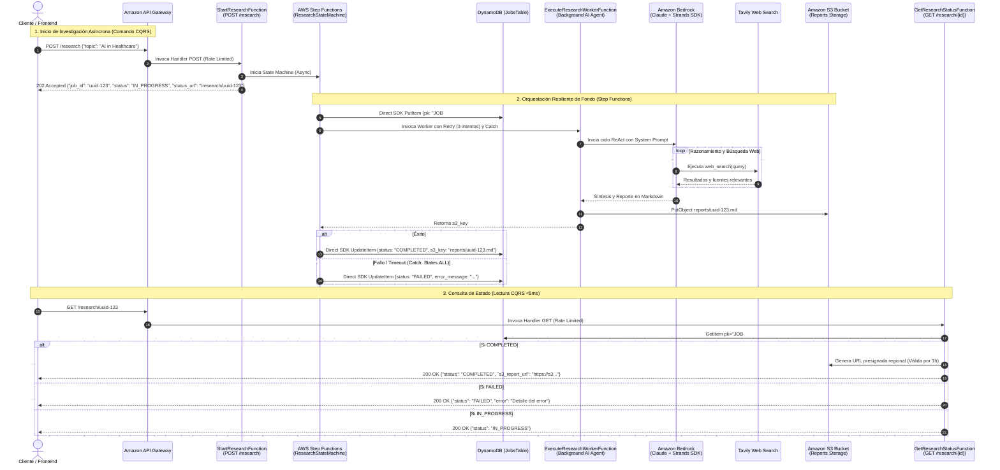
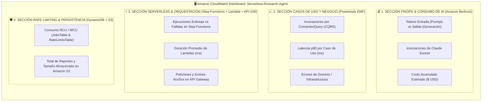
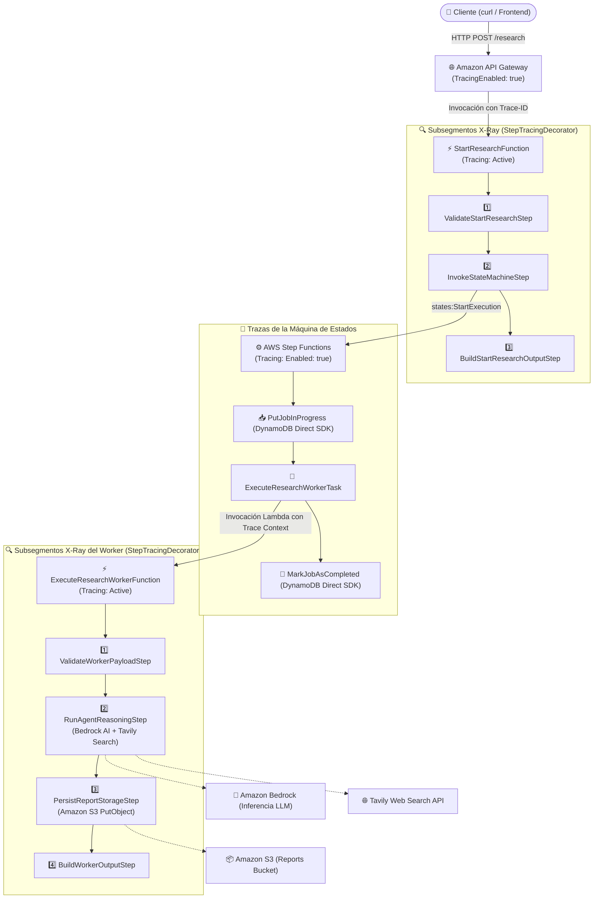

# Serverless AI Research Agent on AWS

[](https://github.com/ruix-soft/serverless-research-agent-aws/actions/workflows/pipeline.yml)
[](https://www.python.org/)
[](https://aws.amazon.com/serverless/sam/)
[](https://aws.amazon.com/step-functions/)
[](https://aws.amazon.com/dynamodb/)
[](https://aws.amazon.com/bedrock/)
[](docs/openapi.yaml)
[](docs/architecture.md)
[](tests/)

Agente autónomo de investigación profunda impulsado por Inteligencia Artificial y construido bajo una arquitectura **100% Serverless-First en AWS**. Utiliza el patrón **ReAct (Reasoning + Acting)** en **Amazon Bedrock**, el framework **Strands Agents SDK**, búsquedas web en tiempo real con **Tavily API**, orquestación distribuida resiliente con **AWS Step Functions**, persistencia de estado con **Amazon DynamoDB** y **Amazon S3**, y despliegues continuos automatizados (**CI/CD**) mediante **GitHub Actions** y **OpenID Connect (AWS OIDC)**.

El proyecto sigue rigurosamente la metodología de arquitectura de software diseñada por **Luis Ruiz** (formalizada bajo la especificación **`arch-core`**), la cual compila y refina años de experiencia en ingeniería de software y cloud computing: arquitectura estricta en **dos capas principales (`app/` y `context/`)**, Arquitectura Hexagonal (Ports & Adapters), Domain-Driven Design (DDD) táctico, Segregación de Comandos y Consultas (CQRS), **Cadena de Responsabilidad (Chain of Responsibility)** para la orquestación atómica de casos de uso, Value Objects para tipado e hidratación de primitivos, inyección manual de dependencias, observabilidad desacoplada con **AWS Lambda Powertools**, y manejo funcional de errores mediante **Railway-Oriented Programming (`Result[O, E]`)**.

---

## 🏛️ Arquitectura del Sistema

El agente resuelve las limitaciones de timeout y estados zombi mediante una **Solución Híbrida Enterprise (AWS Step Functions + DynamoDB + CQRS)**:



---

## 📂 Estructura del Proyecto (Arquitectura en Dos Capas)

La base de código está estructurada en dos capas macro con aislamiento estricto:

```
serverless-research-agent-aws/
├── .github/
│   └── workflows/
│       └── pipeline.yml                  # CI/CD Pipeline con GitHub Actions y AWS OIDC
│
├── src/
│   ├── app/                              # CAPA 1: PRESENTACIÓN Y ENTREGA
│   │   ├── aws/
│   │   │   ├── handlers/                 # Delivery Handlers delgados específicos de AWS Lambda
│   │   │   │   ├── start_research_handler.py
│   │   │   │   ├── get_research_status_handler.py
│   │   │   │   └── execute_research_worker_handler.py
│   │   │   ├── powertools.py             # Instancias singleton de Logger, Tracer y Metrics
│   │   │   └── response.py               # Mapeador de Result y DomainError a respuestas HTTP
│   │   └── controllers/                  # Controladores CQRS con decoradores
│   │       ├── base.py                   # Contratos ICommandHandler y IQueryHandler
│   │       ├── start_research_controller.py
│   │       ├── get_research_status_controller.py
│   │       ├── execute_research_worker_controller.py
│   │       └── decorators/               # Decoradores (LoggingDecorator, MetricsDecorator)
│   │
│   └── context/                          # CAPA 2: BOUNDED CONTEXTS & CORE DDD
│       ├── kit/                          # Kit de utilidades y bloques fundamentales reutilizables
│       │   ├── aggregate_root.py         # Base para Entidades y Aggregates de Dominio
│       │   ├── chain/                    # Motor de Chain of Responsibility (ChainBuilder, Step)
│       │   ├── command/                  # Abstracciones y decoradores para Comandos (CQRS)
│       │   ├── query/                    # Abstracciones y decoradores para Consultas (CQRS)
│       │   ├── criteria/                 # Patrón Criteria (Filtros, Ordenamiento, Paginación)
│       │   ├── dtos/                     # DTOs (Result, Optional, Either, Metadata)
│       │   ├── errors/                   # Jerarquía de DomainError (Validation, NotFound, RateLimit)
│       │   ├── service/                  # Contratos de servicios e interfaces abstractas
│       │   └── vo/                       # Value Objects (Uuid, Date, String, Number, Boolean)
│       │
│       └── research/                     # Bounded Context de Investigación
│           ├── domain/                   # Entidades, Puertos e interfaces del negocio
│           │   ├── entities/             # ResearchJob (AggregateRoot), ResearchJobStatus
│           │   └── ports.py              # IResearchJobRepository, IStateMachineInvokerPort, IReportStoragePort
│           ├── application/              # Casos de Uso estructurados como Pipelines de Pasos
│           │   ├── dtos/                 # DTOs inmutables de entrada y salida
│           │   └── use_cases/            # StartResearchUseCase, GetResearchStatusUseCase, ExecuteResearchWorkerUseCase
│           └── infrastructure/           # Adaptadores concretos y Ensamblaje Manual
│               ├── infrastructure_factory.py        # Fábrica abstracta de inyección de dependencias
│               ├── dynamodb_job_repository_adapter.py # Adaptador DynamoDB para ResearchJob
│               ├── step_functions_invoker_adapter.py # Adaptador de inicio en Step Functions
│               ├── dynamodb_rate_limiter_adapter.py # Adaptador de Rate Limiting atómico con TTL
│               ├── bedrock_agent_adapter.py         # Adaptador Strands + Amazon Bedrock
│               ├── s3_storage_adapter.py            # Adaptador de almacenamiento Amazon S3
│               ├── lambda_invoker_adapter.py        # Adaptador de invocación directa
│               ├── tavily_search_tool.py            # Tool de búsqueda web con Tavily API
│               └── powertools_adapters.py           # Adaptadores de observabilidad (Logger/Metrics)
│
├── infrastructure/
│   └── github-oidc-role.yaml             # CloudFormation: Proveedor OIDC e IAM Role para CI/CD
│
├── docs/                                 # DOCUMENTACIÓN TÉCNICA
│   ├── architecture.md                   # Especificación detallada de arquitectura y flujos
│   ├── openapi.yaml                      # Especificación OpenAPI 3.0 de los endpoints REST
│   └── adr/                              # Architecture Decision Records (ADRs)
│       ├── 0001-use-serverless-ai-agent-architecture.md
│       ├── 0002-async-agent-execution.md
│       ├── 0003-two-layer-clean-architecture-and-design-patterns.md
│       ├── 0004-distributed-rate-limiting-with-dynamodb.md
│       ├── 0005-hybrid-step-functions-and-dynamodb-orchestration.md
│       ├── 0006-enterprise-ci-cd-with-github-actions-and-aws-oidc.md
│       ├── 0007-end-to-end-distributed-tracing-and-observability-with-aws-xray.md
│       └── 0008-unified-finops-operational-and-ai-observability-dashboard.md
│
├── tests/                                # SUITE INTEGRAL DE PRUEBAS (118 Tests)
│   ├── test_controllers.py
│   ├── test_handlers.py
│   ├── test_decorators.py
│   ├── test_domain_result.py
│   ├── test_research_job_entity.py
│   ├── test_dynamodb_job_repository.py
│   ├── test_step_functions_invoker.py
│   ├── test_dynamodb_rate_limiter.py
│   └── test_kit_*.py                     # Tests unitarios del módulo kit
│
├── .flake8                               # Configuración de Linter PEP 8
├── template.yaml                         # Infraestructura como Código (AWS SAM Template)
└── README.md
```

---

## 🎯 Patrones de Diseño Implementados

1. **Arquitectura Hexagonal (Ports & Adapters):** Aislamiento absoluto de la lógica de negocio. Los casos de uso y el dominio no conocen los SDKs de AWS (`boto3`) ni los frameworks de presentación.
2. **Segregación de Responsabilidad de Comandos y Consultas (CQRS):** Separación limpia entre comandos que alteran estado (`CommandHandler`) y lecturas de datos ultrarrápidas (`QueryHandler`).
3. **Cadena de Responsabilidad (Chain of Responsibility):** Todos los casos de uso se ejecutan como un pipeline secuencial de pasos atómicos (`Step[I, O, C]`) que operan sobre un contexto compartido (`Context`).
4. **Trazabilidad Distribuida y Observabilidad Activa (AWS X-Ray + Powertools):** Trazabilidad de extremo a extremo propagando el `X-Amzn-Trace-Id` desde API Gateway hacia Lambdas y Step Functions, con subsegmentos automáticos para cada paso de la cadena (`StepTracingDecorator`), métricas en formato EMF (`CommandMetricsDecorator` / `QueryMetricsDecorator`) y logs estructurados (`StepLoggingDecorator`).
5. **Dashboard Unificado de FinOps & Operaciones (CloudWatch IaC):** Visualización centralizada de consumo de tokens en Amazon Bedrock, costos estimados en USD, latencias p90 y salud serverless.
6. **Patrón Saga / Orquestador Distribuido (AWS Step Functions):** Resiliencia garantizada con reintentos exponenciales automáticos y capturas de excepciones a nivel de infraestructura.
7. **Control de Tasa Distribuido (Rate Limiting Decorator):** Decoradores CQRS respaldados por DynamoDB y TTL para protección contra abusos y ataques *Denial of Wallet*.
8. **Autenticación sin Claves Estáticas (OpenID Connect - OIDC):** Despliegues seguros de CI/CD asumiendo roles temporales en AWS STS.
9. **Programación Orientada a Vías de Tren (Railway-Oriented Programming):** Todas las operaciones retornan instancias de `Result[O, DomainError]` eliminando excepciones no controladas en el flujo de negocio.

---

## 📊 Tablero Unificado de FinOps & Operaciones en Amazon CloudWatch

Desplegado automáticamente como Infraestructura como Código (`AWS::CloudWatch::Dashboard`), consolida 4 cuadrantes esenciales:



---

## 🔍 Observabilidad Distribuida de Extremo a Extremo (AWS X-Ray & CloudWatch)

Toda la arquitectura cuenta con observabilidad activa integrada, permitiendo visualizar el flujo completo de ejecución desde la petición HTTP inicial hasta el razonamiento del LLM y la persistencia del reporte:



---

## 🔒 CI/CD & DevSecOps con AWS OIDC

El despliegue a AWS está 100% automatizado mediante **GitHub Actions** usando **OpenID Connect (OIDC)**, eliminando la necesidad de almacenar `AWS_ACCESS_KEY_ID` o secretos estáticos en GitHub.

### Aprovisionamiento Inicial del Rol OIDC en AWS

Ejecuta el siguiente comando para desplegar la plantilla CloudFormation del rol OIDC:

```bash
aws cloudformation deploy \
  --template-file infrastructure/github-oidc-role.yaml \
  --stack-name serverless-research-agent-ci-role \
  --parameter-overrides GitHubOrg=ruix-soft RepositoryName=serverless-research-agent-aws \
  --capabilities CAPABILITY_NAMED_IAM \
  --region mx-central-1
```

### Configuración en GitHub Actions

En tu repositorio de GitHub (**Settings $\rightarrow$ Secrets and variables $\rightarrow$ Actions**):
1. **`AWS_ROLE_ARN`**: `arn:aws:iam::<ACCOUNT_ID>:role/GitHubActionsServerlessResearchAgentDeployRole`
2. **`AWS_REGION`**: `mx-central-1`

---

## 🚀 Despliegue Manual en AWS (SAM CLI)

### Prerrequisitos
1. [AWS CLI](https://aws.amazon.com/cli/) y [AWS SAM CLI](https://docs.aws.amazon.com/serverless-application-model/latest/developerguide/install-sam-cli.html) instalados y configurados con credenciales de AWS.
2. [Tavily API Key](https://tavily.com/) almacenada en AWS Systems Manager Parameter Store:
   ```bash
   aws ssm put-parameter \
     --name "/serverless-research-agent/tavily-api-key" \
     --type "SecureString" \
     --value "tvly-TU_API_KEY_AQUI" \
     --region mx-central-1
   ```

### Pasos de Despliegue

```bash
# 1. Validar la plantilla SAM
sam validate --lint

# 2. Construir los artefactos
sam build

# 3. Desplegar en AWS
sam deploy --guided
```

---

## 📚 Documentación Técnica & ADRs

- 📐 [**Arquitectura Detallada y Diagramas de Secuencia**](docs/architecture.md)
- 📑 [**Especificación OpenAPI 3.0 (Contrato REST)**](docs/openapi.yaml)
- 🏛️ [**ADR 0001:** Elección de Arquitectura Serverless-First para el Agente de Investigación](docs/adr/0001-use-serverless-ai-agent-architecture.md)
- 🏛️ [**ADR 0002:** Patrón de Ejecución Asíncrona para Agentes de IA en AWS](docs/adr/0002-async-agent-execution.md)
- 🏛️ [**ADR 0003:** Arquitectura en Dos Capas e Implementación de Patrones de Diseño](docs/adr/0003-two-layer-clean-architecture-and-design-patterns.md)
- 🏛️ [**ADR 0004:** Control de Tasa Distribuido (Rate Limiting) con Amazon DynamoDB y Decoradores CQRS](docs/adr/0004-distributed-rate-limiting-with-dynamodb.md)
- 🏛️ [**ADR 0005:** Solución Híbrida: Orquestación Resiliente con AWS Step Functions y Persistencia en DynamoDB](docs/adr/0005-hybrid-step-functions-and-dynamodb-orchestration.md)
- 🏛️ [**ADR 0006:** CI/CD Enterprise con GitHub Actions y Autenticación OIDC (Zero Static Secrets)](docs/adr/0006-enterprise-ci-cd-with-github-actions-and-aws-oidc.md)
- 🏛️ [**ADR 0007:** Trazabilidad Distribuida de Extremo a Extremo con AWS X-Ray y Decoradores de Cadena](docs/adr/0007-end-to-end-distributed-tracing-and-observability-with-aws-xray.md)
- 🏛️ [**ADR 0008:** Tablero Unificado de FinOps, Operaciones y Observabilidad de IA en Amazon CloudWatch](docs/adr/0008-unified-finops-operational-and-ai-observability-dashboard.md)
