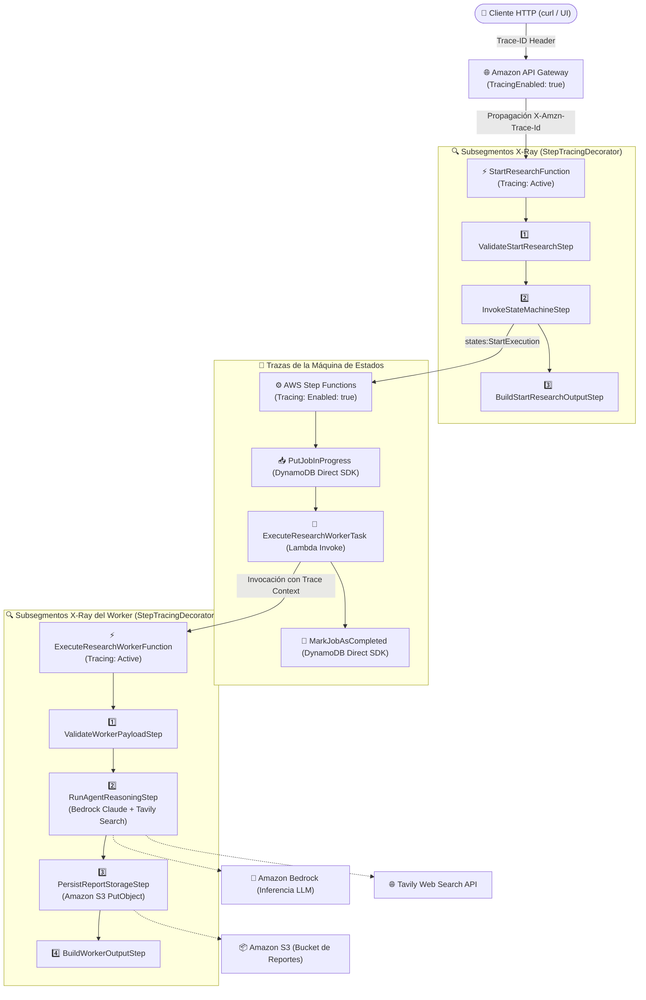

# ADR 0007: Trazabilidad Distribuida de Extremo a Extremo con AWS X-Ray, CloudWatch y Decoradores de Cadena

## Estado
**Aceptado**

## Contexto y Declaración del Problema
En arquitecturas Serverless distribuidas con orquestaciones asíncronas (Amazon API Gateway $\rightarrow$ AWS Lambda $\rightarrow$ AWS Step Functions $\rightarrow$ Amazon DynamoDB $\rightarrow$ Amazon Bedrock $\rightarrow$ Amazon S3), la depuración tradicional basada únicamente en logs planos genera puntos ciegos:
1. Dificultad para correlacionar una solicitud HTTP entrante con los pasos internos del caso de uso y las tareas de fondo de Step Functions.
2. Imposibilidad de medir el tiempo exacto consumido por cada handler individual de la Cadena de Responsabilidad (*Chain of Responsibility*) sin ensuciar la lógica de dominio.
3. Falta de visibilidad gráfica unificada del estado de salud de los servicios externos (Amazon Bedrock y Tavily API).

Bajo la metodología de arquitectura de **Luis Ruiz (`arch-core`)**, se requiere que los aspectos transversales de observabilidad (trazas, métricas y logs estructurados) se implementen mediante **inyección de dependencias y el patrón Decorador**, asegurando que los casos de uso y las entidades del dominio permanezcan 100% agnósticos a los proveedores de nube.

## Decisión de Diseño

Se implementó una solución integral de Observabilidad y Trazabilidad Distribuida compuesta por tres capas:

1. **Infraestructura como Código (AWS SAM / CloudFormation):**
   - Se activó `Tracing: Active` en `Globals.Function` para todas las funciones Lambda.
   - Se activó `TracingEnabled: true` en `Globals.Api` para Amazon API Gateway.
   - Se activó `Tracing: { Enabled: true }` en `ResearchStateMachine` (AWS Step Functions).
   - Se habilitaron las variables de entorno de AWS Lambda Powertools: `POWERTOOLS_TRACER_CAPTURE_RESPONSE: "true"` y `POWERTOOLS_TRACER_CAPTURE_ERROR: "true"`.

2. **Puertos y Adaptadores en la Capa de Infraestructura (`src/context/research/`):**
   - Se definió el contrato de dominio `ITracerPort` y el servicio `TracerService` en el módulo `kit`.
   - Se implementaron los adaptadores `PowertoolsTracerAdapter` y `PowertoolsSegmentAdapter` desacoplando el SDK de X-Ray / Powertools del núcleo de la aplicación.
   - Se extendió `InfrastructureFactory` con el método `create_tracer()`.

3. **Decoradores de Cadena y Controladores (Capa `app/` y `context/kit/`):**
   - **`StepTracingDecorator`:** Envuelve cada paso de la cadena de responsabilidad (`BaseChainStep`), abriendo automáticamente un subsegmento en AWS X-Ray con el nombre del paso, inyectando metadatos (`result.value` o `result.error`) y garantizando el cierre del subsegmento en `finally`.
   - **`StepLoggingDecorator`:** Registra el ciclo de vida del handler (`Handling...`, duración en ms, `Handled successfully.` o `Handled with domain error.`).
   - **`CommandMetricsDecorator` / `QueryMetricsDecorator`:** Capturan dimensiones (`command` / `query`), latencias y conteos de invocación/error emitidos en formato EMF (*Embedded Metric Format*).

## Diagrama de Trazabilidad de Extremo a Extremo

## Consecuencias

### Positivas
- **Visibilidad 100% de la arquitectura:** AWS CloudWatch ServiceLens y el Service Map de X-Ray renderizan en tiempo real todos los nodos y su tasa de éxito/error.
- **Gráfica de Cascada Granular (*Timeline*):** Cada paso de la lógica de negocio (`ValidateStartResearchStep`, `RunAgentReasoningStep`, etc.) aparece como una barra de tiempo individual con sus metadatos asociados.
- **Dominio Puro y Limpio:** La lógica de negocio no tiene imports de `aws_lambda_powertools` ni llamadas a `xray_recorder`. Todo se aplica mediante composición de decoradores e inyección de dependencias.
- **Detección Inmediata de Cuellos de Botella:** Se puede identificar de un vistazo si la latencia proviene de la inferencia del LLM (Bedrock), la búsqueda web (Tavily) o la escritura en DynamoDB/S3.

### Neutrales
- Las trazas de AWS X-Ray tienen un costo marginal en función del volumen de trazas muestreadas (cubierto holgadamente por la capa gratuita de AWS).
