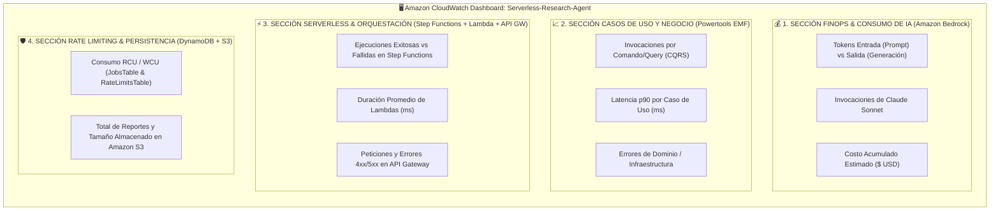

# ADR 0008: Tablero Unificado de FinOps, Operaciones y Observabilidad de IA en Amazon CloudWatch

## Estado
**Aceptado**

## Contexto y Declaración del Problema
En arquitecturas Serverless avanzadas impulsadas por Inteligencia Artificial Generativa, coexisten múltiples dimensiones de observabilidad:
1. **Dimensión Financiera (FinOps):** Consumo de tokens en Amazon Bedrock (Input/Output tokens de Claude Sonnet) y costos directos asociados.
2. **Dimensión de Casos de Uso y Negocio:** Invocaciones de comandos (`StartResearchCommand`, `ExecuteResearchWorkerCommand`), consultas (`GetResearchStatusQuery`), métricas de latencia ($p50$, $p90$, $p99$) y tasas de error de dominio generadas vía AWS Lambda Powertools en formato EMF (*Embedded Metric Format*).
3. **Dimensión de Infraestructura Serverless:** Rendimiento de funciones Lambda (duración, concurrencia, cold starts), ejecuciones de AWS Step Functions y tráfico/errores HTTP en Amazon API Gateway.
4. **Dimensión de Persistencia y Seguridad:** Control de tasa (*Rate Limiting*) en DynamoDB, consumo de RCU/WCU y volumen de almacenamiento de reportes en Amazon S3.

La gestión manual de tableros o la dispersión de métricas en consolas aisladas impide la correlación rápida de incidentes y viola el principio de Infraestructura como Código (IaC).

Bajo la metodología de **Luis Ruiz (`arch-core`)**, se requiere que toda la instrumentación de monitoreo esté completamente automatizada, versionada en el repositorio y desplegada en el pipeline de CI/CD.

## Decisión de Diseño

Se definió e implementó un recurso unificado `AWS::CloudWatch::Dashboard` en [`template.yaml`](../../template.yaml) denominado `Serverless-Research-Agent-${AWS::Region}`, organizado en 4 secciones funcionales:

### Componentes y Widgets del Tablero
1. **Encabezado Ejecutivo:** Identificación de región, entorno de despliegue y referencia metodológica.
2. **FinOps & Tokens Bedrock:** Métricas `InputTokenCount`, `OutputTokenCount` e `Invocations` de `AWS/Bedrock`, complementado con una expresión matemática (`((Input/1000)*0.003) + ((Output/1000)*0.015)`) para el cálculo automático de costo estimado en USD.
3. **Casos de Uso (CQRS):** Métricas `invocations`, `latency` ($p90$) y `errors` bajo el namespace `ResearchAgent` agrupadas por las dimensiones de comando y consulta emitidas por `CommandMetricsDecorator` y `QueryMetricsDecorator`.
4. **Orquestación y Cómputo:** Métricas `ExecutionsSucceeded`, `ExecutionsFailed` de Step Functions, `Duration` por función Lambda, y métricas `Count`, `4XXError`, `5XXError` de API Gateway.
5. **Persistencia:** Consumo de RCU y WCU de las tablas DynamoDB `JobsTable` y `RateLimitsTable`, y métricas de objetos/bytes de Amazon S3.

## Consecuencias

### Positivas
- **Visibilidad Centralizada:** Todos los stakeholders (desarrolladores, arquitectos, líderes de producto y FinOps) cuentan con una vista integral en tiempo real.
- **Detección Inmediata de Anomalías:** Permite identificar al instante si un incremento en la latencia es atribuible al modelo fundacional de Bedrock, a la orquestación de Step Functions o al Rate Limiting.
- **Despliegue 100% Declarativo:** Cero configuración manual en consola AWS; cualquier ajuste a los widgets se despliega mediante Git commit en GitHub Actions.

### Neutrales
- El dashboard de CloudWatch genera un costo estándar de $3.00 USD/mes por tablero adicional más allá de los 3 tableros incluidos en la capa gratuita de AWS.
