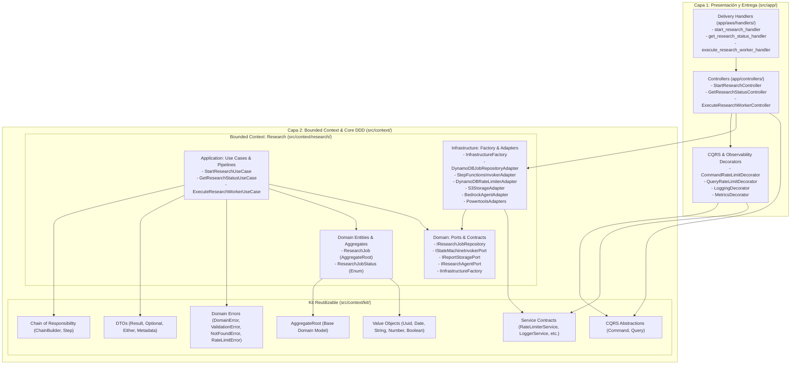
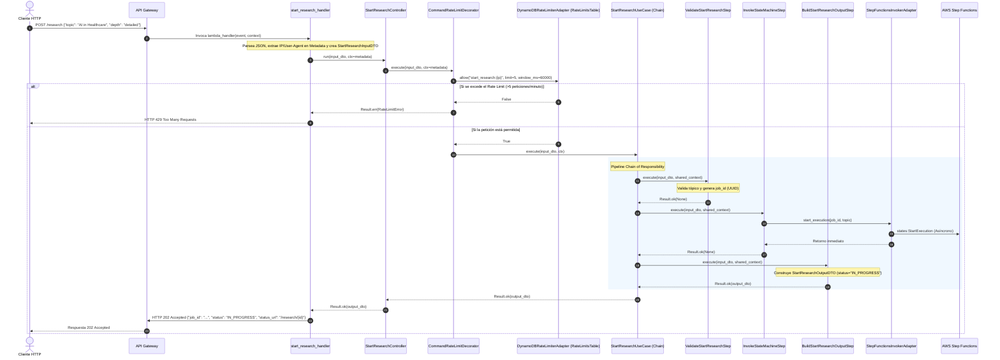
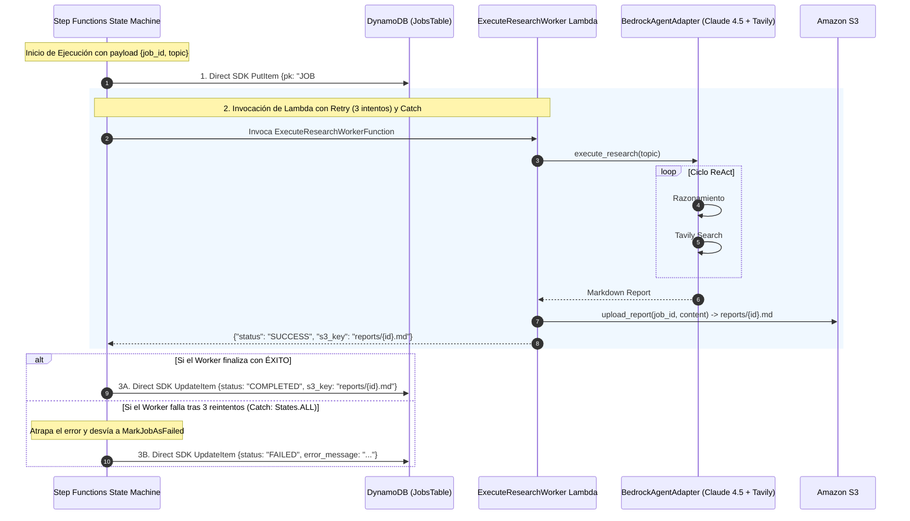
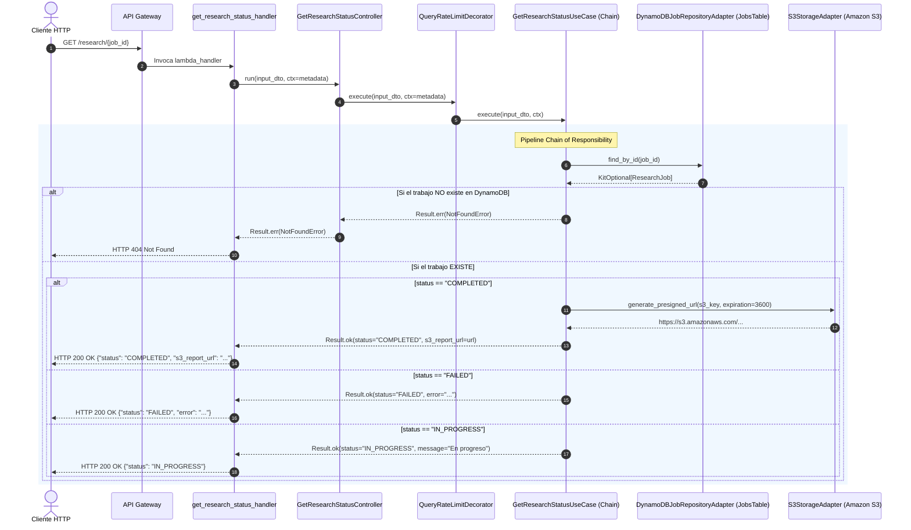

# Arquitectura del Agente Investigador Serverless (Metodología Luis Ruiz)

Este proyecto implementa la metodología y filosofía arquitectónica diseñada y refinada por **Luis Ruiz** (estandarizada bajo la especificación **`arch-core`**), combinando una arquitectura **Serverless-First en AWS** con principios rigurosos de **Arquitectura Hexagonal (Ports & Adapters)**, **Domain-Driven Design (DDD)** táctico, **Segregación de Comandos y Consultas (CQRS)**, orquestación atómica mediante **Cadena de Responsabilidad (Chain of Responsibility)**, control de tasa distribuido (**Rate Limiting con DynamoDB**) y orquestación distribuida resiliente (**AWS Step Functions + DynamoDB JobsTable**).

---

## 1. Diagrama General de la Solución

```mermaid
flowchart TB
    subgraph ClientLayer [Clientes / Consumidores]
        User([Usuario / Frontend / CI-CD])
    end

    subgraph AWSCloud [AWS Serverless Infrastructure]
        APIGW[Amazon API Gateway REST API]

        subgraph LambdaIngress [Capa de Ingesta y Consulta]
            StartFn["StartResearchFunction<br/>(POST /research)"]
            StatusFn["GetResearchStatusFunction<br/>(GET /research/{job_id})"]
        end

        subgraph OrchestrationLayer [Orquestación Distribuida]
            SFN["AWS Step Functions<br/>(ResearchStateMachine)"]
            WorkerFn["ExecuteResearchWorkerFunction<br/>(Background AI Agent)"]
        end

        subgraph PersistenceLayer [Almacenamiento y Estado]
            RateLimitsDB[(DynamoDB: RateLimitsTable<br/>Control de Tasa con TTL)]
            JobsDB[(DynamoDB: JobsTable<br/>Ciclo de Vida de Trabajos con TTL)]
            S3Bucket[(Amazon S3 Bucket<br/>Reportes Markdown)]
        end

        subgraph ExternalServices [Servicios Gestionados e IA]
            Bedrock[Amazon Bedrock<br/>Claude Sonnet 4.5]
            Tavily[Tavily Search API<br/>Búsqueda Web]
        end
    end

    User -->|1. POST /research| APIGW
    APIGW -->|Enruta POST| StartFn
    StartFn <-->|2. Evalúa Rate Limit| RateLimitsDB
    StartFn -->|3. Inicia State Machine| SFN
    StartFn -->>|4. 202 Accepted {job_id}| User

    SFN -->|5. Direct SDK: PutItem IN_PROGRESS| JobsDB
    SFN -->|6. Invoca Worker con Retry/Catch| WorkerFn
    WorkerFn -->|7. Razonamiento ReAct| Bedrock
    Bedrock <-->|8. Tool Web Search| Tavily
    WorkerFn -->|9. Guarda reports/{job_id}.md| S3Bucket
    WorkerFn -->>|10. Retorna s3_key| SFN
    SFN -->|11A. Direct SDK Éxito: UpdateItem COMPLETED| JobsDB
    SFN -->|11B. Direct SDK Fallo: UpdateItem FAILED| JobsDB

    User -->|12. GET /research/{job_id}| APIGW
    APIGW -->|Enruta GET| StatusFn
    StatusFn <-->|13. Evalúa Rate Limit| RateLimitsDB
    StatusFn -->|14. Consulta estado (<5ms)| JobsDB
    StatusFn -->|15. Si COMPLETED: Genera Presigned URL| S3Bucket
    StatusFn -->>|16. 200 OK {status, s3_report_url/error}| User
```

---

## 2. Macro-Separación de Capas: Metodología Arquitectónica Luis Ruiz (`arch-core`)

La estructura del código fuente implementa la metodología y filosofía de diseño desarrollada por **Luis Ruiz**, la cual establece una separación estricta en dos capas fundamentales con reglas de dependencia unidireccionales:



---

## 3. Flujos Detallados de los Servicios

### Flujo 1: Inicio de Investigación Asíncrona (`POST /research`)



---

### Flujo 2: Orquestación Resiliente de Fondo (`ResearchStateMachine`)



---

### Flujo 3: Consulta de Estado y Descarga (`GET /research/{job_id}`)



---

## 4. Matriz de Componentes, Puertos y Adaptadores

| Componente | Capa | Responsabilidad Principal | Puertos / Contratos Asociados |
| :--- | :--- | :--- | :--- |
| **`ResearchJob`** | Dominio (`context/research/`) | Aggregate Root que modela el ciclo de vida del trabajo (`IN_PROGRESS`, `COMPLETED`, `FAILED`). | `AggregateRoot`, `Uuid`, `StringVO`, `DateVO` |
| **`start_research_handler`** | Presentación (`app/aws/`) | Handler Lambda para `POST /research`. Inicia el comando asíncrono. | AWS Lambda Event Bridge |
| **`get_research_status_handler`** | Presentación (`app/aws/`) | Handler Lambda para `GET /research/{id}`. Consulta estado en DynamoDB. | AWS Lambda Event Bridge |
| **`execute_research_worker_handler`**| Presentación (`app/aws/`) | Handler Lambda para ejecución de fondo del agente ReAct. | AWS Step Functions Task |
| **`StartResearchController`** | Presentación (`app/controllers/`) | Orquestador CQRS del comando con Rate Limiting (`CommandRateLimitDecorator`) y Step Functions. | `ICommandHandler`, `RateLimiterService`, `IStateMachineInvokerPort` |
| **`GetResearchStatusController`** | Presentación (`app/controllers/`) | Orquestador CQRS de la consulta con Rate Limiting (`QueryRateLimitDecorator`) y repositorio. | `IQueryHandler`, `RateLimiterService`, `IResearchJobRepository` |
| **`ExecuteResearchWorkerController`**| Presentación (`app/controllers/`) | Orquestador CQRS del comando de ejecución del worker. | `ICommandHandler`, `LoggingDecorator`, `MetricsDecorator` |
| **`StartResearchUseCase`** | Aplicación (`context/research/`) | Pipeline en cadena para iniciar el trabajo e invocar la máquina de estados. | `IStateMachineInvokerPort` |
| **`GetResearchStatusUseCase`** | Aplicación (`context/research/`) | Pipeline en cadena para consultar estado en DynamoDB y generar URL presignada. | `IResearchJobRepository`, `IReportStoragePort` |
| **`ExecuteResearchWorkerUseCase`** | Aplicación (`context/research/`) | Pipeline en cadena para coordinar razonamiento de IA y persistencia en S3. | `IResearchAgentPort`, `IReportStoragePort` |
| **`DynamoDBJobRepositoryAdapter`**| Infraestructura (`context/research/`) | Adaptador concreto para persistir y consultar `ResearchJob` en DynamoDB. | `IResearchJobRepository` |
| **`StepFunctionsInvokerAdapter`** | Infraestructura (`context/research/`) | Adaptador concreto para iniciar ejecuciones en AWS Step Functions. | `IStateMachineInvokerPort` |
| **`DynamoDBRateLimiterAdapter`**| Infraestructura (`context/research/`) | Adaptador concreto de Rate Limiting atómico con TTL en Amazon DynamoDB. | `RateLimiterService` (`context/kit/`) |
| **`S3StorageAdapter`** | Infraestructura (`context/research/`) | Adaptador concreto de persistencia usando Amazon S3 SDK (`boto3`). | `IReportStoragePort` |
| **`BedrockAgentAdapter`** | Infraestructura (`context/research/`) | Adaptador concreto del agente ReAct (Strands SDK + Bedrock + Tavily). | `IResearchAgentPort` |
| **`InfrastructureFactory`** | Infraestructura (`context/research/`) | Fábrica abstracta para ensamblaje manual de todos los adaptadores. | `IInfrastructureFactory` |