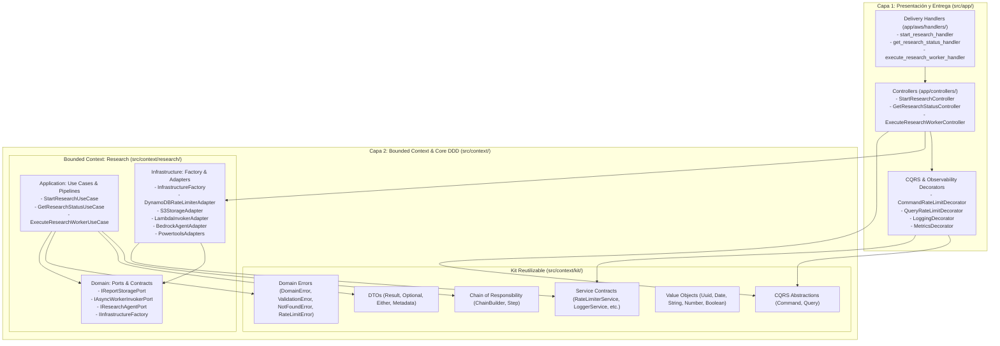
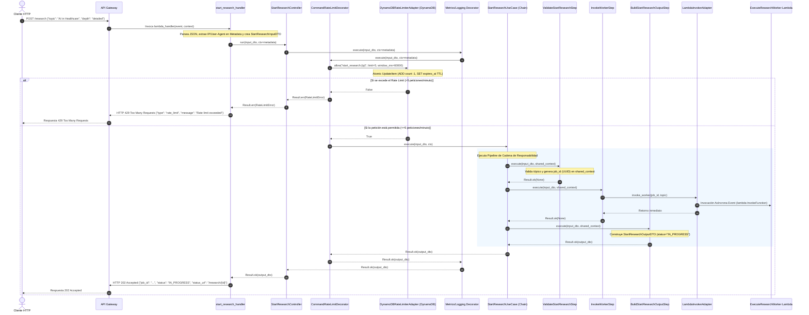
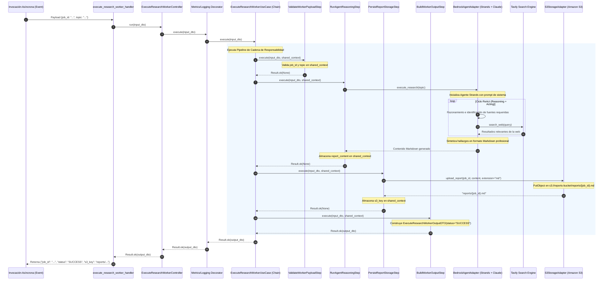
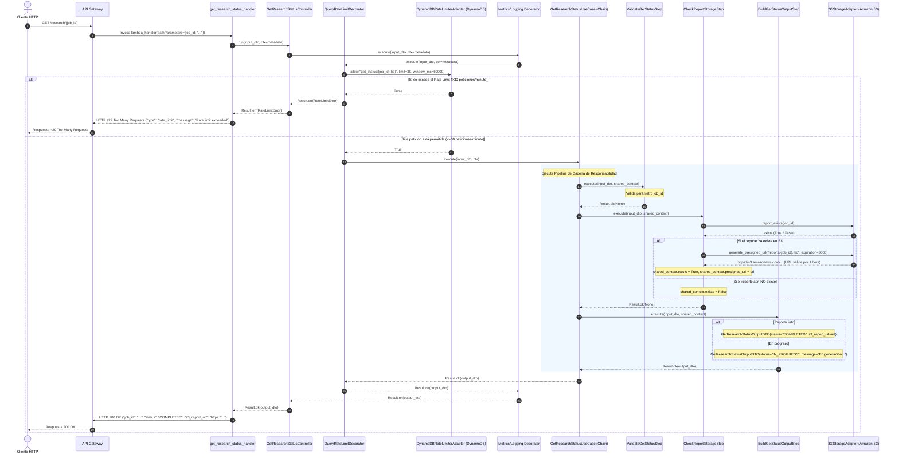

# Arquitectura del Agente Investigador Serverless

Este proyecto implementa una arquitectura **Serverless-First en AWS** guiada por los principios de **Arquitectura Hexagonal (Ports & Adapters)**, **Domain-Driven Design (DDD)**, **Segregación de Comandos y Consultas (CQRS)**, orquestación de casos de uso mediante **Cadena de Responsabilidad (Chain of Responsibility)** y control de tasa distribuido (**Rate Limiting con DynamoDB**).

---

## 1. Diagrama General de la Solución

```mermaid
flowchart TB
    subgraph ClientLayer [Clientes / Consumidores]
        User([Usuario / Frontend / CI-CD])
    end

    subgraph AWSCloud [AWS Serverless Infrastructure]
        APIGW[Amazon API Gateway REST API]

        subgraph LambdaLayer [Funciones AWS Lambda]
            StartFn["StartResearchFunction<br/>(POST /research)"]
            StatusFn["GetResearchStatusFunction<br/>(GET /research/{job_id})"]
            WorkerFn["ExecuteResearchWorkerFunction<br/>(Background AI Agent)"]
        end

        subgraph PersistenceLayer [Almacenamiento y Control de Tasa]
            RateLimitsDB[(Amazon DynamoDB<br/>RateLimitsTable con TTL)]
            S3Bucket[(Amazon S3 Bucket<br/>Reportes Markdown)]
        end

        subgraph ExternalServices [Servicios Gestionados e IA]
            Bedrock[Amazon Bedrock<br/>Claude Sonnet 4.5]
            Tavily[Tavily Search API<br/>Búsqueda Web]
        end
    end

    User -->|1. POST /research| APIGW
    APIGW -->|Enruta POST| StartFn
    StartFn <-->|2. Evalúa Rate Limit (Atómico)| RateLimitsDB
    StartFn -->|3. Invocación Asíncrona (Event)| WorkerFn
    StartFn -->>|4. 202 Accepted {job_id}| User

    WorkerFn -->|5. Razonamiento ReAct| Bedrock
    Bedrock <-->|6. Tool Web Search| Tavily
    WorkerFn -->|7. Guarda reports/{job_id}.md| S3Bucket

    User -->|8. GET /research/{job_id}| APIGW
    APIGW -->|Enruta GET| StatusFn
    StatusFn <-->|9. Evalúa Rate Limit (Atómico)| RateLimitsDB
    StatusFn -->|10. Valida reporte / Genera URL| S3Bucket
    StatusFn -->>|11. 200 OK {s3_report_url}| User
```

---

## 2. Macro-Separación de Capas (`arch-core`)

El código fuente está dividido en dos capas fundamentales con reglas de dependencia unidireccionales:



### Reglas de Dependencia:
1. **`app/`** importa de **`context/`**, pero nunca contiene lógica de dominio ni reglas de negocio.
2. **`context/research/domain/`** es el núcleo puro; no depende de ninguna capa exterior ni de frameworks.
3. **`context/research/application/`** orquesta los casos de uso dependiendo únicamente del dominio y del `kit`.
4. **`context/research/infrastructure/`** implementa los puertos del dominio y contratos del kit (`RateLimiterService`), interactuando con SDKs de AWS (`boto3`) o terceros.

---

## 3. Flujos Detallados de los Servicios

### Flujo 1: Inicio de Investigación Asíncrona (`POST /research`)

Permite al cliente solicitar una investigación profunda sin bloquear la conexión HTTP y protegiendo el sistema contra abuso mediante Rate Limiting.



---

### Flujo 2: Ejecución de Fondo del Agente IA (`ExecuteResearchWorkerFunction`)

Ejecuta el ciclo de investigación profunda autónoma en segundo plano sin restricciones de timeout HTTP.



---

### Flujo 3: Consulta de Estado y Descarga (`GET /research/{job_id}`)

Permite al cliente realizar *polling* protegido con Rate Limiting (hasta 30 peticiones/minuto) para obtener la URL presignada del reporte cuando esté listo.



---

## 4. Matriz de Componentes, Puertos y Adaptadores

| Componente | Capa | Responsabilidad Principal | Puertos / Contratos Asociados |
| :--- | :--- | :--- | :--- |
| **`start_research_handler`** | Presentación (`app/aws/`) | Handler Lambda para `POST /research`. Parsea payloads y metadata y llama al controlador. | AWS Lambda Event Bridge |
| **`get_research_status_handler`** | Presentación (`app/aws/`) | Handler Lambda para `GET /research/{id}`. Extrae path params y metadata y llama al controlador. | AWS Lambda Event Bridge |
| **`execute_research_worker_handler`**| Presentación (`app/aws/`) | Handler Lambda para ejecución de fondo del agente. | AWS Lambda Async Event |
| **`StartResearchController`** | Presentación (`app/controllers/`) | Orquestador CQRS del comando de inicio con Rate Limiting (`CommandRateLimitDecorator`), Logging y Metrics. | `ICommandHandler`, `RateLimiterService` |
| **`GetResearchStatusController`** | Presentación (`app/controllers/`) | Orquestador CQRS de la consulta de estado con Rate Limiting (`QueryRateLimitDecorator`), Logging y Metrics. | `IQueryHandler`, `RateLimiterService` |
| **`ExecuteResearchWorkerController`**| Presentación (`app/controllers/`) | Orquestador CQRS del comando de ejecución del worker con decoradores. | `ICommandHandler`, `LoggingDecorator`, `MetricsDecorator` |
| **`StartResearchUseCase`** | Aplicación (`context/research/`) | Pipeline en cadena para iniciar el trabajo e invocar el worker. | `IAsyncWorkerInvokerPort` |
| **`GetResearchStatusUseCase`** | Aplicación (`context/research/`) | Pipeline en cadena para validar y consultar almacenamiento de reportes. | `IReportStoragePort` |
| **`ExecuteResearchWorkerUseCase`** | Aplicación (`context/research/`) | Pipeline en cadena para coordinar razonamiento de IA y persistencia en S3. | `IResearchAgentPort`, `IReportStoragePort` |
| **`DynamoDBRateLimiterAdapter`**| Infraestructura (`context/research/`) | Adaptador concreto de Rate Limiting atómico con TTL en Amazon DynamoDB. | `RateLimiterService` (`context/kit/`) |
| **`S3StorageAdapter`** | Infraestructura (`context/research/`) | Adaptador concreto de persistencia usando Amazon S3 SDK (`boto3`). | `IReportStoragePort` |
| **`LambdaInvokerAdapter`** | Infraestructura (`context/research/`) | Adaptador concreto para invocar Lambdas asíncronas (`boto3`). | `IAsyncWorkerInvokerPort` |
| **`BedrockAgentAdapter`** | Infraestructura (`context/research/`) | Adaptador concreto del agente ReAct (Strands SDK + Bedrock + Tavily). | `IResearchAgentPort` |
| **`PowertoolsAdapters`** | Infraestructura (`context/research/`) | Adaptadores de observabilidad estructurada (Logger, Metrics). | `ILoggerPort`, `IMetricsPort`, `LoggerService`, `MetricsService` |
| **`InfrastructureFactory`** | Infraestructura (`context/research/`) | Fábrica abstracta para ensamblaje manual de todos los adaptadores. | `IInfrastructureFactory` |